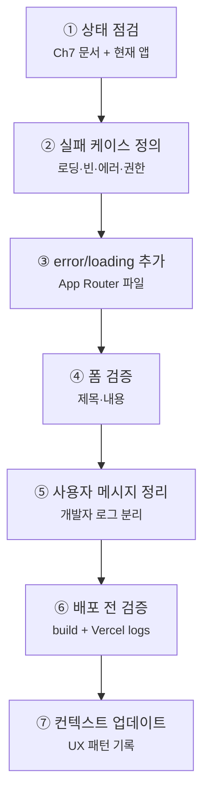

# Chapter 12. 에러 처리와 UX 완성

# Chapter 12. 에러 처리와 UX 완성 — A회차: 강의

> **미션**: 로딩, 빈 상태, 에러, 폼 검증을 추가해 사용자가 불편함 없이 쓰는 블로그로 다듬는다
> 

---

## 이 장의 흐름

이번 장은 새 기능을 크게 추가하지 않는다. Ch10 CRUD와 Ch11 RLS 위에 **실패했을 때의 사용자 경험**을 얹는다. 코드는 길게 외우지 않고, 화면별 실패 케이스를 Copilot에게 정확히 전달한다.



| 단계 | 작업 | 도구 | 절 |
| --- | --- | --- | --- |
| ① | Ch7 문서와 현재 UX 상태 확인 | Copilot + 문서 | 12.2 |
| ② | 실패 케이스 목록화 | 사람 + Copilot | 12.3 |
| ③ | `error.tsx`, `loading.tsx` 추가 | Copilot | 12.4 |
| ④ | 폼 유효성 검증 추가 | Copilot | 12.5 |
| ⑤ | 사용자 메시지/개발자 로그 분리 | Copilot | 12.6 |
| ⑥ | 빌드와 배포 로그 확인 | 터미널 + Vercel CLI | 12.7 |
| ⑦ | 문서 업데이트 | Copilot | 12.8 |

**고정 버전** (Ch7·Ch8 교재 기준):

| 패키지 | 버전 |
| --- | --- |
| `next` | 16.2.1 |
| `@supabase/supabase-js` | 2.47.12 |
| `@supabase/ssr` | 0.5.2 |

> 이 장도 패키지 최신화가 목표가 아니다. Ch7·Ch8 기준을 유지하고, 이미 만든 화면의 사용성을 다듬는다.
> 

---

## 학습목표

1. 로딩, 빈 상태, 에러 상태의 차이를 설명할 수 있다
2. App Router의 `error.tsx`, `loading.tsx` 역할을 이해할 수 있다
3. Supabase/RLS 에러를 사용자 친화적 메시지로 바꿀 수 있다
4. 폼 제출 전 최소 유효성 검증을 구현할 수 있다
5. Vercel 로그와 빌드 결과로 배포 전 문제를 확인할 수 있다

---

## 12.1 왜 UX 완성인가?

기능이 작동해도 다음 상황이 있으면 사용자는 앱이 망가졌다고 느낀다.

| 상황 | 나쁜 경험 | 필요한 처리 |
| --- | --- | --- |
| 데이터 로딩 중 | 흰 화면 | 로딩 UI |
| 게시글 없음 | 빈 화면 | 빈 상태 문구 |
| 권한 없음 | 에러 코드 노출 | 친절한 권한 안내 |
| 저장 실패 | 아무 반응 없음 | 에러 메시지 + 재시도 |
| 폼 누락 | DB 에러 | 입력 전 검증 |

> 개발자에게는 원문 에러가 필요하고, 사용자에게는 해결 가능한 문장이 필요하다. 두 메시지를 섞지 않는다.
> 

---

## 12.2 프로젝트 기준 문서 정비와 현재 상태 확인 `🤖 바이브코딩`

```
#file:context.md #file:todo.md #file:ARCHITECTURE.md

Ch12 에러 처리와 UX 개선 작업을 시작하기 전에 기준 문서와 현재 프로젝트 상태를 정비해줘.

작업 규칙:
1. context.md, todo.md, ARCHITECTURE.md가 없으면 Ch7 기준으로 만들어줘.
2. AGENTS.md, CLAUDE.md, .agent/rules/project.md가 없으면 필요한 경우 Ch7 기준으로 만들어줘.
3. 파일이 있으면 Ch12 기준과 충돌하는 부분을 바로 수정해줘.
4. 실제 package.json이 교재 기준보다 최신이면 "교재 기준"과 "현재 설치 기준"을 함께 적어줘.

확인할 것:
- Ch10 CRUD가 구현된 화면
- Ch11 RLS 적용 상태
- 로딩/빈 상태/에러 처리가 없는 화면
- 폼 검증이 필요한 화면
- 기존 디자인 규칙과 shadcn/ui 사용 여부

아직 코드는 수정하지 말고, 개선 대상 목록만 제안해줘.
```

---

## 12.3 실패 케이스 먼저 정의 `🤖 바이브코딩`

Copilot에게 “예쁘게 고쳐줘”라고 하지 않는다. 실패 상황을 먼저 고정한다.

UX 개선은 색이나 여백을 먼저 고치는 일이 아니다. 사용자가 기다리는 중인지, 데이터가 없는지, 권한이 없는지, 입력이 잘못됐는지를 구분해서 알려주는 일이다. 실패 케이스를 먼저 정의하면 AI가 막연히 화면을 꾸미는 대신 필요한 상태 UI와 메시지를 정확히 만들 수 있다.

```
다음 화면의 실패 케이스를 정리해줘.

대상:
- /posts
- /posts/[id]
- /posts/new
- 로그인/회원가입 화면

분류:
1. loading
2. empty
3. error
4. auth/session expired
5. permission denied(RLS)
6. validation

각 케이스마다 사용자 메시지와 개발자 로그에 남길 정보를 나눠서 제안해줘.
아직 코드는 수정하지 마.
```

---

## 12.4 `error.tsx`, `loading.tsx` 추가 `🤖 바이브코딩`

App Router는 경로 폴더에 `loading.tsx`, `error.tsx`를 두면 해당 구간의 상태 UI를 처리할 수 있다.

`loading.tsx`는 데이터가 아직 도착하지 않았을 때 사용자가 빈 화면을 보지 않게 해 주는 파일이다. `error.tsx`는 렌더링 중 문제가 생겼을 때 앱 전체가 무너지는 대신 친절한 안내와 다시 시도 버튼을 보여준다. 두 파일은 기능을 새로 만드는 파일이 아니라, 실패와 대기 상태를 사용자가 이해할 수 있게 만드는 안전장치다.

### Copilot 프롬프트 1: 전역 에러 UI

```
app/error.tsx를 만들어줘.

요구사항:
- "use client" 컴포넌트
- 사용자에게는 친절한 메시지만 표시
- 개발자용으로 console.error(error) 남기기
- "다시 시도" 버튼은 reset() 호출
- 기존 디자인 스타일을 크게 바꾸지 않기
- App Router 기준
```

error/loading 파일을 만든 뒤 Copilot에게 다시 검토시킨다.

```
방금 만든 error.tsx/loading.tsx 관련 코드를 검토해줘.

반드시 확인할 것:
1. error.tsx에는 "use client"가 있는가?
2. reset()을 호출하는 다시 시도 버튼이 있는가?
3. 사용자에게 원문 stack trace나 민감한 에러를 보여주지 않는가?
4. loading UI가 레이아웃을 크게 흔들지 않는가?
5. 새 라이브러리를 추가하지 않았는가?

문제가 있으면 바로 수정하고, 수정한 파일을 요약해줘.
```

### Copilot 프롬프트 2: 로딩 UI

```
app/loading.tsx와 posts 관련 loading UI를 추가해줘.

요구사항:
- /posts 목록은 카드 스켈레톤 형태
- /posts/[id] 상세는 제목/본문 자리 스켈레톤
- 새 라이브러리 추가 없이 Tailwind CSS만 사용
- 텍스트가 겹치거나 레이아웃이 흔들리지 않게 고정 높이 사용
```

---

## 12.5 폼 유효성 검증 `🤖 바이브코딩`

DB 에러가 나기 전에 브라우저에서 먼저 막는다.

폼 유효성 검증은 사용자가 잘못된 값을 서버로 보내기 전에 화면에서 바로 알려주는 과정이다. 예를 들어 제목이 비어 있거나 내용이 너무 짧으면 Supabase까지 요청을 보내지 않고 입력창 근처에서 안내한다. 이것은 보안 장치가 아니라 사용자 경험 장치이며, 실제 데이터 보안은 여전히 RLS와 서버/DB 규칙이 담당한다.

```
게시글 작성/수정 폼에 클라이언트 유효성 검증을 추가해줘.

요구사항:
- 제목은 필수, 최소 2자
- 내용은 필수, 최소 10자
- 제출 중에는 버튼 비활성화
- 실패 시 input 아래에 사용자 메시지 표시
- 성공/실패 후 중복 제출 방지
- 서버/Supabase 에러 원문은 console.error로 남기고, 화면에는 친절한 메시지 표시
- 새 라이브러리 추가 금지
```

메시지 예:

| 상황 | 사용자 메시지 |
| --- | --- |
| 제목 없음 | 제목을 입력해주세요. |
| 내용 짧음 | 내용을 10자 이상 입력해주세요. |
| 권한 없음 | 이 작업을 수행할 권한이 없습니다. |
| 네트워크 오류 | 인터넷 연결을 확인하고 다시 시도해주세요. |
| 알 수 없는 오류 | 잠시 후 다시 시도해주세요. |

---

## 12.6 에러 메시지와 로그 분리 `🤖 바이브코딩`

Supabase 에러 코드를 그대로 화면에 보여주지 않는다.

사용자에게 필요한 정보와 개발자에게 필요한 정보는 다르다. 사용자는 `42501`이나 stack trace를 봐도 문제를 해결할 수 없으므로 “권한이 없습니다”, “다시 시도해주세요” 같은 문장이 필요하다. 반대로 개발자는 원인 추적을 위해 콘솔 로그나 실제 에러 객체가 필요하므로, 화면 메시지와 개발자 로그를 분리한다.

```
Supabase/네트워크 에러를 사용자 메시지로 변환하는 작은 유틸 함수를 만들어줘.

요구사항:
- 위치는 기존 구조에 맞춰 lib/errors.ts 또는 lib/error-message.ts 제안
- 42501 또는 row-level security -> "이 작업을 수행할 권한이 없습니다."
- Failed to fetch -> "인터넷 연결을 확인해주세요."
- not found 계열 -> "요청한 게시글을 찾을 수 없습니다."
- 기본값 -> "일시적인 오류가 발생했습니다. 잠시 후 다시 시도해주세요."
- 개발자용 console.error는 호출한 쪽에서 남길 수 있게 한다
```

에러 메시지 유틸을 만든 뒤 Copilot에게 변환 규칙을 검토시킨다.

```
방금 만든 에러 메시지 변환 코드를 검토해줘.

반드시 확인할 것:
1. 42501 또는 row-level security는 권한 안내 메시지로 바꾸는가?
2. Failed to fetch는 네트워크 안내 메시지로 바꾸는가?
3. not found 계열은 게시글 없음 안내로 바꾸는가?
4. 기본 에러 메시지가 친절한가?
5. 개발자용 console.error와 사용자 메시지를 분리했는가?

문제가 있으면 바로 수정하고, 수정한 파일을 요약해줘.
```

---

## 12.7 배포 전 검증 `⌨️ CLI`

로컬 빌드를 먼저 확인한다.

```bash
npm run build
```

보안 키와 구버전 API를 확인한다.

```bash
git grep -nE "service_role|SUPABASE_SERVICE_ROLE|sb_secret_|sbp_" -- 'app/**' 'lib/**' 'components/**' 'contexts/**' 2>/dev/null
git grep -nE "next/router|auth\.signIn\(" -- 'app/**' 'lib/**' 'components/**' 'contexts/**' 2>/dev/null
```

배포 후 문제가 있으면 Vercel CLI로 로그를 확인한다.

```bash
vercel ls
vercel env ls
vercel logs
```

> Ch8에서 Vercel 연결을 했다면 이 장에서도 CLI로 배포 상태, 환경변수 등록 여부, 로그를 확인한다. 환경변수의 실제 값은 CLI 출력만으로 단정하지 말고 Vercel 대시보드에서 눈으로 확인한다.
> 

검증 명령은 Copilot에게 직접 실행하게 하고, 브라우저와 대시보드에서 눈으로 본 항목만 사람이 적어 준다.

```
Ch12 UX 검증을 위해 아래 명령을 직접 실행하고 결과를 판정해줘.

실행할 명령:
1. npm run build
2. git grep -nE "service_role|SUPABASE_SERVICE_ROLE|sb_secret_|sbp_" -- 'app/**' 'lib/**' 'components/**' 'contexts/**' 2>/dev/null
3. git grep -nE "next/router|auth\.signIn\(" -- 'app/**' 'lib/**' 'components/**' 'contexts/**' 2>/dev/null
4. vercel env ls
5. vercel logs

사람이 눈으로 확인한 항목:
1. Vercel 대시보드:
- NEXT_PUBLIC_SUPABASE_URL:
- NEXT_PUBLIC_SUPABASE_ANON_KEY:
- production/preview 적용 대상:

2. 브라우저 검증:
- /posts 로딩/빈 상태:
- 없는 게시글:
- 제목 없이 제출:
- RLS 권한 실패 메시지:

통과/실패/추가 확인 필요로 나눠줘.
문제가 있으면 수정할 파일을 제안해줘.
터미널 실행 권한이 없으면, 실행하지 못한 명령을 알려주고 내가 결과를 붙여 넣을 수 있게 요청해줘.
```

---

## 12.8 검증 시나리오

| 번호 | 시나리오 | 기대 결과 |
| --- | --- | --- |
| ① | `/posts` 로딩 중 | 스켈레톤 또는 로딩 표시 |
| ② | 게시글이 0개 | 빈 상태 문구 |
| ③ | 없는 게시글 ID 접속 | not found 또는 안내 화면 |
| ④ | 제목 없이 제출 | 제목 입력 안내 |
| ⑤ | RLS로 저장 실패 | 권한 안내 메시지 |
| ⑥ | 배포 URL 접속 | 로컬과 동일하게 동작 |

---

## 흔한 AI 실수

| 실수 | 증상 | 해결 |
| --- | --- | --- |
| 에러 코드를 그대로 노출 | `42501`, stack trace 표시 | 사용자 메시지로 변환 |
| `error.tsx`에 `"use client"` 누락 | 빌드/런타임 에러 | 첫 줄에 추가 |
| 로딩 UI가 레이아웃을 흔듦 | 화면 점프 | 스켈레톤 크기 고정 |
| 폼 제출 중 버튼 활성 | 중복 저장 | 제출 중 disabled |
| 새 라이브러리 과도 추가 | 코드 복잡 | Tailwind/기존 컴포넌트 우선 |

위 실수 목록도 Copilot에게 점검시킨다.

```
Ch12 흔한 AI 실수 목록과 Ch9 이후 공통 AI 실수 목록을 기준으로 현재 코드를 점검해줘.

점검할 것:
1. 사용자 화면에 42501, stack trace, 원문 에러가 그대로 노출되는가?
2. app/error.tsx에 "use client"가 빠졌는가?
3. loading/skeleton UI가 레이아웃을 크게 흔드는가?
4. 폼 제출 중 버튼이 계속 활성화되어 중복 제출 가능한가?
5. 불필요한 새 라이브러리를 추가했는가?
6. 개발자 로그와 사용자 메시지가 분리되어 있는가?
7. auth.signIn()을 사용한 곳이 있는가?
8. next/router 또는 pages router를 사용한 곳이 있는가?
9. @supabase/supabase-js에서 직접 createClient를 만들어 브라우저 세션을 처리한 곳이 있는가?
10. onAuthStateChange cleanup에서 subscription.unsubscribe()가 빠진 곳이 있는가?
11. middleware.ts가 프로젝트 루트가 아니라 app/ 안에 있는가?
12. service_role 키나 서버 전용 키를 클라이언트에서 사용한 곳이 있는가?
13. 이메일/비밀번호 외 소셜 로그인 코드가 섞였는가?

문제가 있으면 바로 수정해줘.
수정 후 어떤 파일과 어떤 항목을 고쳤는지 요약해줘.
```

---

## 핵심 정리 + B회차 과제 스펙

### 이번 시간 핵심 3가지

1. UX 완성은 성공 화면보다 실패 화면을 먼저 정의하는 일이다.
2. 사용자 메시지와 개발자 로그는 분리해야 한다.
3. 배포 전에는 `npm run build`, `git grep`, `vercel logs`로 최소 검증을 한다.

### B회차 과제 스펙

1. Ch7 컨텍스트 문서 확인
2. 실패 케이스 목록 작성
3. `app/error.tsx` 추가
4. `app/loading.tsx` 또는 posts loading UI 추가
5. 게시글 폼 유효성 검증
6. Supabase 에러 메시지 변환
7. `npm run build` 통과
8. Vercel 배포 URL 검증

### 제출 항목

```
1. GitHub 저장소 URL
2. Vercel 배포 URL
3. 로딩 상태 또는 스켈레톤 화면 스크린샷
4. 빈 상태 또는 없는 게시글 안내 화면 스크린샷
5. 제목 없이 제출했을 때 검증 메시지 스크린샷
6. 권한 실패 또는 Supabase/RLS 에러가 사용자 친화적 메시지로 보이는 화면 스크린샷
7. npm run build 성공 결과 또는 터미널 캡처
8. vercel logs 확인 결과 또는 문제 없음 캡처
```

교사는 GitHub에서 `app/error.tsx`, `app/loading.tsx`, 폼 검증 코드, 에러 메시지 변환 유틸을 확인한다. Vercel에서는 실패 상황에서 원문 에러 코드나 stack trace가 사용자에게 그대로 노출되지 않는지 확인한다.

### 컨텍스트 업데이트

작업을 마칠 때 Copilot에게 붙여 넣는다.

Ch12 에러 처리와 UX 개선 작업을 마무리하려고 해.

Ch7에서 만든 문서들을 업데이트해줘.

1. context.md
- 추가한 error.tsx/loading.tsx
- 적용한 화면별 loading/empty/error 상태
- 폼 검증 규칙
- Supabase/RLS 에러 메시지 변환 규칙
- Vercel 배포 검증 결과

2. todo.md
- 에러 UI
- 로딩 UI
- 빈 상태
- 폼 검증
- 에러 메시지 변환
- 빌드/배포 검증

3. ARCHITECTURE.md
- 공통 UX 패턴
- 에러 메시지 정책
- 로딩/빈 상태 컴포넌트 위치

4. .github/copilot-instructions.md 또는 AGENTS.md
- 사용자에게 원문 에러 코드 노출 금지
- 개발자 로그는 유지
- 새 라이브러리 추가 전 이유 설명

파일이 없으면 Ch7 기준에 맞춰 새로 만들고, 이미 있으면 Ch12 작업 결과와 충돌하는 부분만 정리해줘.