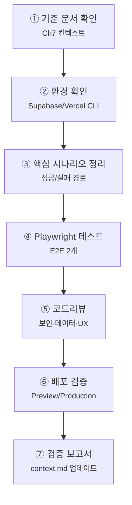

# Chapter 13. AI 결과 검증

# Chapter 13. AI 결과물 검증 — 테스트·디버깅·코드리뷰·배포 검증

> **미션**: AI와 함께 만든 블로그가 실제로 안전하게 동작하는지 스스로 검증한다
> 

---

## 이 장의 흐름

이번 장은 새 기능을 많이 만들지 않는다. Ch8~Ch12에서 만든 Supabase 블로그를 **테스트, 디버깅, 코드리뷰, 배포 검증**으로 확인한다. AI는 작성자가 아니라 검증 보조자로 사용한다.



| 단계 | 작업 | 도구 | 절 |
| --- | --- | --- | --- |
| ① | Ch7 문서와 전체 구현 상태 확인 | Copilot + 문서 | 13.2 |
| ② | Supabase/Vercel 환경 확인 | CLI | 13.3 |
| ③ | 성공/실패 시나리오 정리 | 사람 + Copilot | 13.4 |
| ④ | Playwright E2E 테스트 작성 | Copilot + 터미널 | 13.5 |
| ⑤ | 코드리뷰와 보안 스캔 | 사람 + AI + CLI | 13.6 |
| ⑥ | 배포 검증 | Vercel CLI + 브라우저 | 13.7 |
| ⑦ | 검증 보고서와 컨텍스트 업데이트 | Copilot | 13.8 |

**고정 버전** (Ch7·Ch8 교재 기준):

| 패키지 | 버전 |
| --- | --- |
| `next` | 16.2.1 |
| `@supabase/supabase-js` | 2.47.12 |
| `@supabase/ssr` | 0.5.2 |

> Playwright는 이 장에서 새로 설치할 수 있다. 나머지 앱 패키지 기준은 Ch7·Ch8 교재 기준을 유지한다.
> 

---

## 학습목표

1. AI 결과물을 테스트, 디버깅, 코드리뷰, 배포 검증의 4축으로 점검할 수 있다
2. Playwright로 핵심 사용자 시나리오를 자동화할 수 있다
3. 보안 키 노출, RLS 우회, 구버전 API 사용을 CLI로 찾을 수 있다
4. Preview와 Production 환경 차이를 점검할 수 있다
5. 검증 결과를 `context.md`와 제출 보고서에 기록할 수 있다

---

## 13.1 왜 검증인가?

AI가 만든 앱은 겉으로는 작동해도 아래 문제가 숨어 있을 수 있다.

| 위험 | 예시 | 잡는 방법 |
| --- | --- | --- |
| 보안 | `service_role` 노출, RLS 우회 | 코드리뷰 + grep |
| 데이터 | 글 저장/삭제 누락 | E2E 테스트 |
| UX | 흰 화면, 에러 코드 노출 | 수동 시나리오 |
| 배포 | 로컬만 동작, Vercel 실패 | Vercel 로그 |
| 회귀 | 고친 기능이 다시 깨짐 | Playwright |

> 이번 장의 핵심 태도: AI의 “괜찮습니다”를 믿지 말고, 명령과 시나리오로 확인한다.
> 

---

## 13.2 프로젝트 기준 문서 정비와 전체 상태 확인 `🤖 바이브코딩`

검증은 새 세션에서 시작하는 것이 좋다. 작성할 때의 맥락과 검증할 때의 맥락을 분리한다.

```
#file:context.md #file:todo.md #file:ARCHITECTURE.md

Ch13 최종 검증을 시작하기 전에 기준 문서와 전체 구현 상태를 정비해줘.

작업 규칙:
1. context.md, todo.md, ARCHITECTURE.md가 없으면 Ch7 기준으로 만들어줘.
2. AGENTS.md, CLAUDE.md, .agent/rules/project.md가 없으면 필요한 경우 Ch7 기준으로 만들어줘.
3. 파일이 있으면 Ch13 검증 기준과 충돌하는 부분을 바로 수정해줘.
4. 실제 package.json이 교재 기준보다 최신이면 "교재 기준"과 "현재 설치 기준"을 함께 적어줘.

확인할 것:
- Ch8 Supabase 연결
- Ch9 인증
- Ch10 CRUD
- Ch11 RLS
- Ch12 에러/로딩/폼 검증
- 남은 todo

아직 앱 코드는 수정하지 말고, 검증해야 할 핵심 시나리오 목록만 제안해줘.
확인되지 않은 것은 "확인 필요"라고 표시해줘.
```

---

## 13.3 환경 확인 `⌨️ CLI`

Supabase와 Vercel이 같은 프로젝트를 보고 있는지 확인한다.

최종 검증은 코드만 보는 일이 아니라, 로컬 앱, Supabase 프로젝트, Vercel 배포가 같은 기준을 보고 있는지 확인하는 일이다. 환경이 어긋나면 코드가 맞아도 로그인, 데이터 저장, 배포 URL 동작이 실패할 수 있다. 그래서 테스트를 만들기 전에 CLI로 프로젝트 연결과 빌드 상태를 먼저 확인한다.

```bash
npx supabase --version
npx supabase projects list
```

Vercel 프로젝트 연결과 배포 상태를 확인한다.

```bash
vercel ls
```

로컬 빌드부터 확인한다.

```bash
npm run build
```

환경 확인 결과를 Copilot에게 판정시킨다.

```
Ch13 환경 확인 결과를 판정해줘.

1. npx supabase --version:
(결과 붙여넣기)

2. npx supabase projects list:
(결과 붙여넣기)

3. vercel ls:
(결과 붙여넣기)

4. npm run build:
(결과 붙여넣기)

통과/실패/추가 확인 필요로 나눠줘.
문제가 있으면 다음 확인 명령이나 수정할 파일을 제안해줘.
```

---

## 13.4 성공/실패 시나리오 정리 `🤖 바이브코딩`

테스트는 “되어야 하는 것”과 “막혀야 하는 것”을 함께 본다.

최종 검증은 기능이 한 번 동작하는지 보는 단계가 아니다. 사용자가 성공해야 하는 흐름과 실패해야 안전한 흐름을 모두 확인하는 단계다. 특히 인증과 RLS는 “막혀야 하는 요청이 정말 막히는가”가 중요하므로, 행복 경로와 거절 경로를 나누어 적는다.

```
최종 검증 시나리오를 성공 경로와 실패 경로로 나눠줘.

대상 기능:
- 회원가입/로그인/로그아웃
- 게시글 목록/상세/작성/수정/삭제
- RLS: 다른 사용자 글 수정/삭제 차단
- 에러/로딩/빈 상태
- Vercel 배포 URL

출력 형식:
| 번호 | 시나리오 | 입력값 | 기대 결과 | 검증 방법 |

확인되지 않은 것은 "확인 필요"로 표시해줘.
```

권장 핵심 시나리오:

| 번호 | 시나리오 | 기대 결과 |
| --- | --- | --- |
| ① | 비로그인 사용자가 `/posts` 조회 | 성공 |
| ② | 비로그인 사용자가 `/posts/new` 접근 | `/login` 이동 |
| ③ | 로그인 사용자가 글 작성 | 성공 |
| ④ | 작성자가 본인 글 수정/삭제 | 성공 |
| ⑤ | 다른 사용자가 수정/삭제 시도 | 실패 |
| ⑥ | 제목 없이 제출 | 검증 메시지 표시 |
| ⑦ | 배포 URL에서 핵심 흐름 실행 | 로컬과 동일 |

---

## 13.5 Playwright E2E 테스트 `🤖 + ⌨️`

Playwright는 실제 브라우저를 자동으로 조작해 사용자의 행동을 재현하는 테스트 도구다. 단위 테스트처럼 함수 하나만 보는 것이 아니라 로그인, 페이지 이동, 폼 입력, 저장 결과처럼 여러 화면이 이어지는 흐름을 확인한다. 이 장에서는 복잡한 CI보다 핵심 성공 경로 1개와 거절 경로 1개를 자동화하는 데 집중한다.

### 13.5.1 설치

```bash
npm init playwright@latest
```

수업에서는 복잡한 CI까지 가지 않는다.

| 질문 | 권장 답 |
| --- | --- |
| TypeScript 사용 | Yes |
| tests 폴더 | Yes |
| GitHub Actions 추가 | No |
| 브라우저 설치 | Yes |

### 13.5.2 Copilot 프롬프트: 테스트 2개

```
Playwright E2E 테스트를 작성해줘.

파일: tests/auth-crud.spec.ts

테스트 1: 행복 경로
1. /login 접속
2. TEST_EMAIL, TEST_PASSWORD 환경변수로 로그인
3. /posts/new 이동
4. 제목/내용 입력 후 저장
5. /posts 목록 또는 상세에서 새 글 제목 확인

테스트 2: 거절 경로
1. 로그아웃 또는 새 브라우저 컨텍스트
2. /posts/new 접속
3. /login으로 이동하는지 확인

규칙:
- App Router 경로 기준
- 테스트 계정 정보는 코드에 직접 쓰지 말고 process.env 사용
- 셀렉터는 가능하면 getByRole, getByLabel 사용
- 구현된 UI 텍스트가 다르면 현재 코드에 맞춰 조정
```

### 13.5.3 실행

```bash
npx playwright test
npx playwright test --ui
```

테스트가 실패하면 바로 고치지 말고 재현 정보를 정리한다.

```
Playwright 테스트가 실패했어.

실패 정보:
- 테스트 이름:
- 실패 단계:
- 기대 결과:
- 실제 결과:
- 에러 메시지:

가능한 원인 3개와 확인 순서를 제안해줘.
아직 코드는 수정하지 마.
```

---

## 13.6 코드리뷰와 보안 스캔 `👁️ + 🤖 + ⌨️`

먼저 CLI로 자동 스캔한다.

코드리뷰는 “코드가 예쁜가”보다 “위험한 실수가 남아 있는가”를 먼저 보는 과정이다. 보안 키 노출, 구버전 API, XSS 위험처럼 문자열 검색으로 잡을 수 있는 문제는 먼저 CLI로 훑고, 그 다음 AI에게 맥락 있는 리뷰를 맡긴다. 자동 스캔이 통과해도 실제 권한 흐름과 배포 동작은 별도로 확인해야 한다.

```bash
git grep -nE "service_role|SUPABASE_SERVICE_ROLE|sb_secret_|sbp_" -- 'app/**' 'lib/**' 'components/**' 'contexts/**' 'middleware.ts' 2>/dev/null
git grep -nE "next/router|auth\.signIn\(" -- 'app/**' 'lib/**' 'components/**' 'contexts/**' 2>/dev/null
git grep -nE "dangerouslySetInnerHTML|eval\\(" -- 'app/**' 'components/**' 2>/dev/null
```

grep 실행 결과를 Copilot에게 판정시킨다.

```
아래 보안/코드리뷰 grep 결과를 판정해줘.

1. 민감 키 grep:
(결과 붙여넣기)

2. 구버전 라우터/API grep:
(결과 붙여넣기)

3. XSS 위험 grep:
(결과 붙여넣기)

출력이 있으면 심각도와 수정할 파일을 제안해줘.
출력이 없으면 통과로 표시해줘.
```

Copilot 리뷰 프롬프트:

```
이 프로젝트의 최종 코드리뷰를 해줘.

관점:
1. 보안: service_role 노출, RLS 우회 가능성, XSS
2. 데이터: posts/profiles 컬럼명 불일치, user_id 처리
3. 인증: 세션 유지, 로그아웃, 보호 라우트
4. UX: 로딩/빈 상태/에러 메시지
5. 유지보수: 중복 코드, 죽은 코드, 구버전 API

출력:
- 심각도 높은 문제부터
- 파일 경로와 이유
- 확인 필요/수정 필요 구분
- 추측이면 추측이라고 표시
```

---

## 13.7 배포 검증 `⌨️ CLI + 브라우저`

Vercel 배포 상태를 확인한다.

```bash
vercel --version
vercel ls
vercel env ls
vercel logs
```

`vercel env ls`는 환경변수 이름과 적용 대상만 확인한다. 실제 값이 Ch8 Supabase 프로젝트와 같은지는 Vercel 대시보드에서 눈으로 확인한다.

```
Project → Settings → Environment Variables
```

필수:

```bash
NEXT_PUBLIC_SUPABASE_URL
NEXT_PUBLIC_SUPABASE_ANON_KEY
```

Supabase URL Configuration도 눈으로 확인한다.

```
Authentication → URL Configuration
```

확인할 URL:

```
http://localhost:3000/**
https://본인-vercel-주소.vercel.app/**
```

브라우저에서 배포 URL을 열고 최소 시나리오를 확인한다.

| 번호 | 배포 검증 | 기대 결과 |
| --- | --- | --- |
| ① | 홈/목록 페이지 접속 | 정상 로드 |
| ② | 로그인 | 성공 |
| ③ | 글 작성 | 성공 |
| ④ | 로그아웃 | 성공 |
| ⑤ | 비로그인 `/posts/new` | 로그인 페이지 이동 |

> 환경변수나 Supabase URL Configuration을 바꾼 뒤에는 반드시 새 배포가 필요하다.
> 

배포 검증 명령은 Copilot에게 직접 실행하게 하고, 브라우저와 대시보드에서 눈으로 본 항목만 사람이 적어 준다.

```
배포 검증을 위해 아래 명령을 직접 실행하고 결과를 판정해줘.

실행할 명령:
1. vercel --version
2. vercel ls
3. vercel env ls
4. vercel logs

사람이 눈으로 확인한 항목:
1. Vercel 대시보드:
- NEXT_PUBLIC_SUPABASE_URL:
- NEXT_PUBLIC_SUPABASE_ANON_KEY:
- production/preview 적용 대상:

2. Supabase URL Configuration:
- localhost URL:
- Vercel 배포 URL:

3. 브라우저 수동 검증:
- 홈/목록:
- 로그인:
- 글 작성:
- 로그아웃:
- 비로그인 /posts/new:

통과/실패/추가 확인 필요로 나눠줘.
확인하지 않은 항목은 절대 통과로 쓰지 마.
터미널 실행 권한이 없으면, 실행하지 못한 명령을 알려주고 내가 결과를 붙여 넣을 수 있게 요청해줘.
```

---

## 13.8 검증 보고서 작성 `🤖 바이브코딩`

최종 제출에는 “무엇을 확인했는지”가 남아야 한다.

```
최종 검증 보고서를 작성해줘.

포함할 내용:
1. 테스트한 환경: local, Vercel preview/production
2. 통과한 시나리오
3. 실패했지만 수정한 시나리오
4. 아직 확인 필요한 항목
5. 보안 점검 결과: service_role 노출 여부, RLS 우회 테스트
6. 배포 URL

형식은 Markdown 표 중심으로 간결하게 작성해줘.
확인하지 않은 것은 절대 통과로 쓰지 말고 "확인 필요"라고 써줘.
```

### 컨텍스트 업데이트

```
Ch13 최종 검증을 마무리하려고 해.

Ch7에서 만든 문서들을 업데이트해줘.

1. context.md
- 최종 검증 일자
- Playwright 테스트 파일과 결과
- 수동 검증 시나리오 결과
- 코드리뷰/보안 grep 결과
- Vercel 배포 검증 결과
- 남은 확인 필요 항목

2. todo.md
- E2E 테스트
- 보안 스캔
- 배포 검증
- 검증 보고서
- 제출 완료 여부

3. ARCHITECTURE.md
- 최종 검증 루틴
- 배포 환경 정보
- 핵심 사용자 흐름

4. .github/copilot-instructions.md 또는 AGENTS.md
- 검증 단계에서는 확인하지 않은 것을 통과로 쓰지 않기
- 코드리뷰는 보안 > 데이터 정확성 > UX > 성능 순으로 보기

파일이 없으면 Ch7 기준에 맞춰 새로 만들고, 이미 있으면 Ch13 검증 결과와 충돌하는 부분만 정리해줘.
```

---

## 흔한 AI 실수

| 실수 | 증상 | 해결 |
| --- | --- | --- |
| 확인 안 한 항목을 통과로 표시 | 허위 보고 | “확인 필요”로 남기기 |
| 행복 경로만 테스트 | 보안 실패 놓침 | 실패 경로 포함 |
| 테스트 계정 하드코딩 | 비밀번호 노출 | 환경변수 사용 |
| 로그 없이 추측 | 원인 오판 | DevTools/Vercel logs 첨부 |
| 로컬만 확인 | 배포 실패 누락 | Vercel URL에서 재검증 |

위 실수 목록도 Copilot에게 점검시킨다.

```
Ch13 흔한 AI 실수 목록과 Ch9 이후 공통 AI 실수 목록을 기준으로 최종 검증 결과와 현재 코드를 점검해줘.

점검할 것:
1. 확인하지 않은 항목을 통과로 표시한 곳이 있는가?
2. 행복 경로만 있고 실패 경로 테스트가 빠졌는가?
3. 테스트 계정 이메일/비밀번호를 코드에 하드코딩했는가?
4. DevTools, Vercel logs, Supabase logs 없이 추측으로 원인을 적은 곳이 있는가?
5. 로컬만 확인하고 Vercel 배포 URL 검증이 빠졌는가?
6. 보안 grep 결과를 확인하지 않았는데 통과로 쓴 곳이 있는가?
7. auth.signIn()을 사용한 곳이 있는가?
8. next/router 또는 pages router를 사용한 곳이 있는가?
9. @supabase/supabase-js에서 직접 createClient를 만들어 브라우저 세션을 처리한 곳이 있는가?
10. onAuthStateChange cleanup에서 subscription.unsubscribe()가 빠진 곳이 있는가?
11. middleware.ts가 프로젝트 루트가 아니라 app/ 안에 있는가?
12. service_role 키나 서버 전용 키를 클라이언트에서 사용한 곳이 있는가?
13. 이메일/비밀번호 외 소셜 로그인 코드가 섞였는가?

문제가 있으면 바로 수정해줘.
수정 후 어떤 파일과 어떤 검증 항목을 고쳤는지 요약해줘.
```

---

## 핵심 정리 + 실습 과제 스펙

### 이번 시간 핵심 3가지

1. AI 결과물은 테스트, 디버깅, 코드리뷰, 배포 검증 4축으로 확인한다.
2. 성공 경로와 실패 경로를 함께 검증해야 기능과 보안을 모두 볼 수 있다.
3. 확인하지 않은 항목은 “확인 필요”로 남긴다.

### 과제 스펙

1. Playwright 설치
2. E2E 테스트 2개 작성: 행복 경로 1개, 거절 경로 1개
3. `npm run build` 통과
4. 보안 grep 3개 실행
5. Vercel 배포 URL에서 핵심 시나리오 수동 검증
6. 검증 보고서 작성
7. `context.md` 또는 제출 문서에 검증 결과 기록

### 제출 항목

```
1. GitHub 저장소 URL
2. Vercel 배포 URL
3. 검증 보고서 Markdown
4. Playwright 테스트 실행 결과 스크린샷 또는 로그
5. npm run build 성공 결과 또는 터미널 캡처
6. 보안 grep 3개 실행 결과 캡처
7. Vercel 배포 URL에서 수동 검증한 핵심 시나리오 결과
```